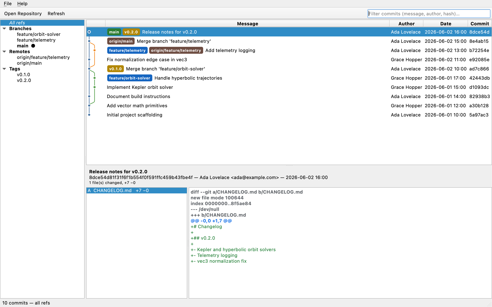

# GitScope

**A local-only, read-only, secure Git repository visualization client.**

GitScope is a lightweight C++ desktop application for browsing local Git
repositories: branches, tags, commit history, the commit graph, and code
diffs. It never modifies your repositories and never touches the network.

[](https://github.com/obeyer1/GitScope/actions/workflows/ci.yml)
[](LICENSE)



## Features

- **Commit graph** — colored lane rendering of branching and merging history,
  in the same topological order `git log --graph` uses.
- **Branches, remotes & tags** — sidebar listing every ref; click one to scope
  the history, or browse all refs at once.
- **Ref decorations** — commits are labeled with chips for local branches,
  remote branches, tags, and the checked-out branch.
- **Diff viewer** — per-file unified diffs with syntax-highlighted
  additions/removals, rename and copy detection, and per-file `+/-` stats.
- **Fast filtering** — filter the visible history by message, author, or hash.
- **Open anywhere** — point GitScope at any folder inside a repository
  (or drag & drop it onto the window); the repository root is discovered
  automatically. Bare repositories are supported.

## Security model

GitScope is designed to be safe to point at any repository, including ones
you do not trust:

| Guarantee | How it is enforced |
| --- | --- |
| **Read-only** | Only libgit2 inspection APIs are used. GitScope never writes to the object database, index, refs, working tree, or any config file. |
| **Local-only** | No network code is linked or called. libgit2's transport layer is never invoked; Qt's network module is not used. |
| **No subprocesses** | GitScope never executes `git` or any other program, so `PATH` hijacking and argument-injection issues cannot occur. |
| **No hooks** | Git hooks only run for mutating operations, which GitScope never performs. |
| **Config isolation** | At startup, system/global/XDG git config search paths are cleared via `git_libgit2_opts(GIT_OPT_SET_SEARCH_PATH, …)`. A hostile machine-wide config cannot influence parsing. Repository-local config is still honored read-only. |
| **Repository ownership checks** | libgit2's default ownership validation (the `safe.directory` equivalent) is left enabled. |

See [SECURITY.md](SECURITY.md) for the full threat model and how to report
vulnerabilities.

## Building from source

GitScope requires a C++20 compiler, CMake ≥ 3.22, Qt ≥ 6.4, and libgit2.

### macOS

```bash
brew install cmake ninja qt libgit2 pkgconf
cmake --preset release -DCMAKE_PREFIX_PATH="$(brew --prefix)"
cmake --build --preset release
open build/release/gitscope.app
```

### Ubuntu / Debian

```bash
sudo apt install build-essential cmake ninja-build pkg-config \
                 qt6-base-dev libgl1-mesa-dev libgit2-dev
cmake --preset release
cmake --build --preset release
./build/release/gitscope
```

### Windows

Not officially supported yet. Building with [vcpkg](https://vcpkg.io)
(`qtbase`, `libgit2`) and MSVC should work — contributions welcome.

### Running the tests

```bash
ctest --preset release
```

The tests exercise the Qt-free core (repository access and graph layout) and
run headless.

## Usage

- `File → Open Repository…` (or drag & drop a folder, or `gitscope /path/to/repo`).
- Click a branch, remote, or tag in the sidebar to scope the log; choose
  **All refs** for the full picture.
- Select a commit to see its metadata, changed files, and diffs.
- Type in the filter box to search messages, authors, and hashes.

## Architecture

```
src/git   Qt-free core library (gitscope_core)
          ├─ Repository   read-only libgit2 wrapper (branches, tags, log, diffs)
          ├─ RaiiHandles  unique_ptr deleters for every libgit2 object we touch
          └─ GraphBuilder pure lane-assignment algorithm for the commit graph
src/ui    Qt Widgets front end
          ├─ MainWindow        window chrome, actions, wiring
          ├─ CommitTableModel  history table + filter proxy
          ├─ GraphDelegate     paints the commit graph column
          ├─ SummaryDelegate   paints ref chips next to commit messages
          ├─ BranchPanel       branches / remotes / tags sidebar
          └─ DiffViewer        commit details, file list, highlighted diffs
tests     headless unit tests for the core (CTest)
```

The split keeps every libgit2 call in one reviewable place and lets the
history/graph logic be tested without a GUI.

## Contributing

Pull requests are welcome — see [CONTRIBUTING.md](CONTRIBUTING.md).
The one hard rule: **GitScope stays read-only.** Changes that introduce
mutating Git operations, network access, or subprocess execution will not be
accepted.

## License

[MIT](LICENSE)
